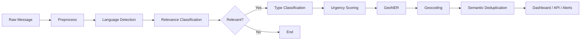

# 🌍 CrisisLens

### Multilingual Crisis & Disaster Response NLP Pipeline

[](https://www.python.org/downloads/)
[](https://opensource.org/licenses/Apache-2.0)
[](https://sdgs.un.org/goals/goal11)
[](https://sdgs.un.org/goals/goal13)

**CrisisLens** is an AI-powered pipeline that turns messy, multilingual disaster messages (social media, SMS, hotlines) into structured, actionable intelligence for first responders, NGOs, and government agencies. It classifies crisis relevance, event type, urgency, extracts locations, and deduplicates—in 176+ languages.

---

## What we solve

During disasters, huge numbers of messages arrive from Twitter/X, WhatsApp, SMS, and hotlines. They are mixed: real pleas for help, updates, rumours, and irrelevant content. They come in many languages and are often informal and short. Humans cannot triage everything in real time.

**CrisisLens** takes one or many messages and outputs:

- **Is it crisis-related?** (yes/no + confidence)
- **What kind of event?** (rescue, medical, supply, damage, casualty, volunteer, update, displacement)
- **How urgent?** (CRITICAL / HIGH / MEDIUM / LOW)
- **Where?** (place names → coordinates when possible)
- **Is it a duplicate?** (semantic similarity to already-seen messages)

So the problem we solve is **noise and overload in disaster communication**—by filtering, classifying, prioritizing, and geolocating crisis content automatically.

---

## Why it matters

- **Scale:** In major disasters, millions of posts can appear in hours. Manual triage is impossible.
- **Speed:** Help is most effective when deployed quickly. Delays in understanding *what* and *where* cost lives and resources.
- **Language:** Affected populations post in local and global languages. Single-language tools are not enough.
- **Impact:** Better, faster, multilingual crisis intelligence supports better decisions and more lives saved. The project aligns with **UN SDG 11** (sustainable cities, disaster resilience) and **SDG 13** (climate action, disaster response).

---

## How it can be used

| Use case | How |
|----------|-----|
| **Interactive demo** | Run the Streamlit dashboard → select or paste messages → see relevance, type, urgency, locations, map, and analytics. |
| **API integration** | Send `POST /api/v1/analyze` or `/api/v1/analyze/batch` to get JSON results for apps, scripts, or other services. |
| **Priority feed** | Use the dashboard’s Priority Feed tab (or export CSV) for urgency-sorted triage. |
| **Crisis map** | View geocoded crisis messages on an interactive map (Folium). |
| **Evaluation** | Run `evaluate.py` on HumAID (or your CSV) to get precision, recall, F1; run `evaluate_plots.py` for confusion matrix, ROC, and precision–recall figures. |

---

## Why it was built

CrisisLens was built to bridge gaps in existing tools: (1) strong **multilingual** relevance detection, (2) a **single pipeline** that does filtering + type + urgency + location + dedup, and (3) an **easy-to-use dashboard and API** for non-experts. Each technology was chosen for performance, multilingual support, and practicality—e.g. XLM-RoBERTa for 100 languages, BART-MNLI for zero-shot type/urgency, shared BART to save memory, Nominatim for free geocoding, FastAPI for async batch, Streamlit for quick demos.

---

## ✨ Key features

| Feature | Description |
|---------|-------------|
| 🌐 **Multilingual** | 176 languages (fastText + XLM-RoBERTa) |
| 🎯 **Crisis detection** | Binary relevance; fine-tuned model reaches **96%+ F1** on HumAID |
| 📋 **8 event types** | Rescue, medical, infrastructure, supply, casualty, volunteer, update, displacement |
| 🚨 **Urgency** | 4 levels (CRITICAL → LOW) with keyword + semantic analysis |
| 📍 **Locations** | NER + geocoding to lat/lng (Nominatim) |
| 🔁 **Deduplication** | Semantic similarity–based duplicate detection |
| 🗺️ **Crisis map** | Folium map with urgency-colored markers |
| 📊 **Analytics** | Plotly charts, metrics, CSV export |
| 🚨 **Priority feed** | Urgency-sorted view + CSV export |
| 🔌 **REST API** | FastAPI with Swagger at `/docs` |
| 🐳 **Docker** | One-command run with Docker Compose |

---

## 🏗️ Architecture



**Pipeline (text):**

```
Raw Message → Preprocess → Language Detection → Relevance Classification
                                                        ↓ (if relevant)
                                          Type Classification (8 labels)
                                                        ↓
                                          Urgency Scoring (4 levels)
                                                        ↓
                                          GeoNER → Geocoding
                                                        ↓
                                          Semantic Deduplication
                                                        ↓
                                          Dashboard / API / Alerts
```

---

## 📸 Screenshots & evaluation figures

| Asset | Description |
|-------|-------------|
| [Dashboard — Analyze](docs/screenshots/dashboard-analyze.png) | Input message + analysis result (relevance, type, urgency, locations). |
| [Priority Feed](docs/screenshots/dashboard-priority-feed.png) | Urgency-sorted crisis messages with CSV export. |
| [Crisis Map](docs/screenshots/dashboard-map.png) | Interactive map with crisis hotspots (Folium). |
| [Analytics](docs/screenshots/dashboard-analytics.png) | Metrics, charts, and export. |
| [API Docs](docs/screenshots/api-docs.png) | Swagger UI at `/docs`. |

**Evaluation figures** (generate with `python evaluate_plots.py --data data/raw/humaid/test.csv --model_path models/finetuned --output_dir docs/figures`):

- **Confusion matrix** — TP, FP, TN, FN for relevance classification.
- **ROC curve + AUC** — Ranking quality.
- **Precision–Recall curve + AP** — When positives are rare.

See [docs/SCREENSHOTS.md](docs/SCREENSHOTS.md) for capture instructions and [docs/METRICS.md](docs/METRICS.md) for reproduction steps.

---

## 📈 Evaluation & metrics

| Metric | Zero-Shot (BART-MNLI) | Fine-Tuned (XLM-RoBERTa on HumAID) |
|--------|------------------------|-------------------------------------|
| **Relevance F1** | 0.76–0.82 | **0.9649** |
| **Precision** | — | 0.9521 |
| **Recall** | — | 0.978 |
| **Type Macro-F1** | 0.68–0.74 | — |
| **Urgency κ** | 0.65–0.71 | — |
| **Geocoding recall** | ~0.72 | — |

Fine-tuned on HumAID validation set (7,793 samples). Test-set evaluation:  
`python evaluate.py --data data/raw/humaid/test.csv --model_path models/finetuned --output test_results.json`

Reproduction and figures: **[docs/METRICS.md](docs/METRICS.md)**.

---

## Improvements done & roadmap

### Implemented

- **Shared BART** — One BART instance for relevance (fallback), type, and urgency (~1.7 GB instead of ~5 GB).
- **Geocoder cache** — In-memory cache with eviction (e.g. 2000 entries) to avoid unbounded growth and respect rate limits.
- **Deduplicator fix** — Similarity computed against existing embeddings before appending (no off-by-one).
- **Async batch API** — `/analyze` and `/analyze/batch` run in a thread pool so the server stays responsive.
- **Train & evaluate** — `train.py` (XLM-RoBERTa on HumAID), `evaluate.py` (precision, recall, F1, JSON output), `evaluate_plots.py` (confusion matrix, ROC, PR curve).
- **Dashboard** — Instant demo for samples, Priority Feed, Crisis Map, Analytics, CSV export, User Guide tab, HumAID metrics and Limitations in sidebar.
- **CI** — GitHub Actions: ruff lint, unit tests (preprocessor).

### Future

- Per-language evaluation (F1 by language).
- Fine-tune type and urgency if labelled data is available.
- Better geocoding (recall, obscure names).
- Explainability (e.g. which words drive relevance/type/urgency).
- Real-time streams (e.g. Twitter/X, WhatsApp).
- Stronger handling of implicit language; bias and fairness analysis.

---

## Early-stage product direction (from PRD)

During scoping, a related **product direction** was documented: **4D-VAD** (4D Visual Assessment of Acute Distress)—a *video-based* system to detect acute distress (panic/anxiety vs possible cardiac) from live camera or upload, with **speed-first** design: voice and video advice within seconds, LLM chatbot for follow-up, and clear disclaimers (not a medical device). That PRD focused on latency (e.g. detection in 15–30 s, advice playback in &lt;5 s), pre-recorded voice/video assets, and accessibility. CrisisLens is the **text/NLP** crisis pipeline; 4D-VAD represents a complementary, vision-and-physiology track for acute distress support.

---

## 🚀 Quick start

### 1. Clone & install

```bash
git clone https://github.com/yourusername/CrisisLens.git
cd CrisisLens
python -m venv venv
venv\Scripts\activate   # Windows
# source venv/bin/activate   # macOS/Linux
pip install -r requirements.txt
```

### 2. Data (optional, for training/eval)

```bash
python data/download_datasets.py
```

### 3. Run the dashboard

```bash
streamlit run src/dashboard/app.py
```

Open **http://localhost:8501** → select a sample → click **Analyze** (instant for samples; live pipeline for custom text). Use the **📖 User Guide** tab for full documentation inside the app.

### 4. Run the API

```bash
uvicorn src.api.main:app --reload
```

Open **http://localhost:8000/docs** for Swagger.

### 5. Test the API

```bash
curl -X POST http://localhost:8000/api/v1/analyze \
  -H "Content-Type: application/json" \
  -d '{"text": "URGENT: Building collapsed in Hatay, people trapped!"}'
```

---

## 🐳 Docker

```bash
docker-compose up --build
```

- **API:** http://localhost:8000/docs  
- **Dashboard:** http://localhost:8501  

---

## 📊 API endpoints

| Method | Endpoint | Description |
|--------|----------|-------------|
| `POST` | `/api/v1/analyze` | Analyze a single message |
| `POST` | `/api/v1/analyze/batch` | Analyze up to 100 messages |
| `GET` | `/api/v1/stats` | Pipeline statistics |
| `POST` | `/api/v1/reset` | Reset pipeline state |
| `GET` | `/api/v1/health` | Health check |

---

## 🛠️ Tech stack

| Component | Technology |
|-----------|------------|
| ML | PyTorch, Hugging Face Transformers |
| Models | XLM-RoBERTa (fine-tuned), BART-large-MNLI, Davlan NER, sentence-transformers (MiniLM) |
| Language ID | langdetect (fastText optional) |
| Geocoding | Nominatim (geopy) |
| Backend | FastAPI, Uvicorn |
| Dashboard | Streamlit, Folium, Plotly |
| Container | Docker, Docker Compose |

---

## 🧪 Tests

```bash
python -m pytest tests/test_preprocessor.py -v
python -m pytest tests/test_pipeline.py -v
python -m pytest tests/test_api.py -v
python -m pytest tests/ -v
```

---

## 📁 Project structure

```
CrisisLens/
├── config/settings.py
├── data/download_datasets.py
├── src/
│   ├── pipeline/     # preprocessor, language_detector, relevance_classifier,
│   │                 # type_classifier, urgency_scorer, geo_ner, geocoder,
│   │                 # deduplicator, orchestrator, shared_bart
│   ├── api/           # main, routes, models
│   └── dashboard/     # app.py, demo_data, user_guide_content
├── tests/
├── docs/              # screenshots, figures, SCREENSHOTS.md, METRICS.md
├── train.py, evaluate.py, evaluate_plots.py
├── requirements.txt, Dockerfile, docker-compose.yml
└── README.md
```

---

## 📚 References

- Alam et al., *CrisisBench*; *HumAID: Human-Annotated Disaster Tweets*
- Conneau et al., *XLM-RoBERTa*
- Lewis et al., *BART*
- UN SDG 11, 13

---

## 📜 License

Apache License 2.0 — see [LICENSE](LICENSE).

---

<p align="center">
  Built for a more resilient world<br>
  <small>🌍 CrisisLens — Because every minute matters during a disaster</small>
</p>
